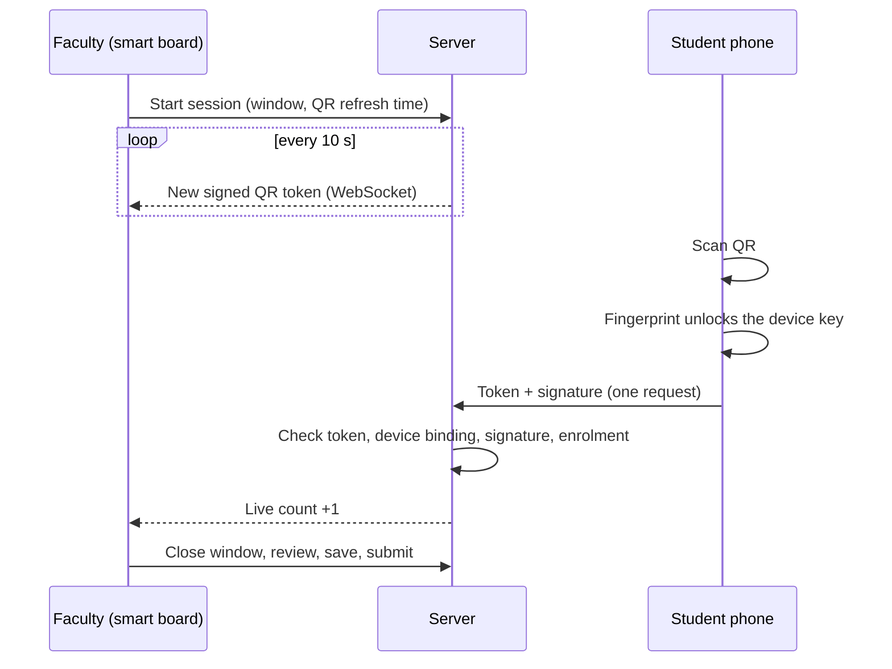
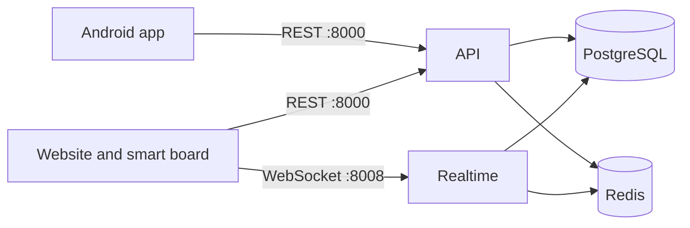

<p align="center">
  <picture>
    <source media="(prefers-color-scheme: dark)" srcset="docs/assets/logo-dark.svg">
    
  </picture>
</p>

<p align="center">
  <em>"Present, Sir."<br>Every Indian classroom, every morning. We're just making sure it's true.</em>
</p>

<p align="center">
  
  
  
  
</p>

---

## Why this exists

Proxy attendance is the oldest trick in the college. A friend says "present, sir" for you, or a photo of the QR code goes around the class group. Most attendance tools digitise the roll call and stop there, so the cheating just moves to a new medium.

PresentSir treats attendance as a security problem first and a reporting problem second. The scan has to come from *your* registered phone, unlocked by a fingerprint, in the last few seconds, in that lecture. Anything that still looks odd goes to the faculty as a flag with reasons. It never becomes an automatic penalty.

Built for a 24 hour hackathon, so the scope is deliberately tight: get the attendance path right, then build the analytics on top of data we can trust.

## How a scan works



One request after the scan, nothing prefetched, so the flow stays well inside the QR refresh time.

## Architecture



Two small Python processes, one database, one Redis. The realtime service only pushes QR tokens and live counts. All decisions are made by the API.

## What we chose not to build

A lot of the design is in the things we said no to.

- **Storing fingerprints.** Android never hands them to an app, and we would not want them anyway. The server holds a public key. The private key lives in the phone's secure hardware and only signs after a fingerprint match.
- **GPS geofencing.** Indoor GPS drifts by tens of metres and mock-location apps exist. It would reject honest students and stop nobody determined.
- **Client-side "is this app cloned?" checks.** The client can lie. We verify a signature on the server instead.
- **Machine learning for flags.** Every flag is a plain rule with a reason a teacher can read and overrule. We also track how many flags get dismissed, so we can see our own false-alarm rate.
- **Face unlock.** It adds latency, and the QR is gone in ten seconds.

## What it proves, and what it doesn't

**Proves:** a student's registered phone, unlocked by a fingerprint enrolled on that phone, scanned the current QR.

**Doesn't prove:** that the fingerprint belongs to the student. Registration is supervised at the start of the semester and the key is invalidated when a new fingerprint is added, which narrows the gap without closing it. A friend relaying the live QR is caught only by soft signals (timing, repeated pairs, headcount mismatch), which go to a faculty review queue.

We would rather say that plainly than pretend otherwise.

## What's in it

| Area | Highlights |
|---|---|
| Attendance | Rotating signed QR, one user per device, biometric-signed scan, two-step save and submit, manual marking with a required reason |
| Integrity | Append-only audit log, proxy-risk flags with reasons, faculty review queue, student disputes |
| Students | Subject-wise attendance, trends, "you need N more lectures to reach the threshold" |
| Faculty | Live board with counter, roster review, shortage list, early-warning list, CSV reports |
| Admin | Supervised device registration, phone-change approvals, attendance threshold, institution analytics |

## Repository layout

```
presentsir/
  backend/    FastAPI: REST API (:8000) and realtime service (:8008)
  web/        React website: faculty board, admin, student read-only
  app/        React Native Android app
  docs/       BACKEND_SPEC.md, FRONTEND_SPEC.md, assets/
```

## Running it locally

You need Python 3.11, Node, Docker, Android Studio, and a **real Android phone** with USB debugging. Emulators can't produce a proper hardware-backed biometric key.

```bash
docker compose up -d                       # PostgreSQL + Redis

cd backend
cp .env.example .env
pip install -r requirements.txt
alembic upgrade head
python scripts/seed.py                     # realistic demo data
uvicorn app.main:app --port 8000
uvicorn app.realtime:app --port 8008       # second terminal

cd web && npm install && npm run dev       # http://localhost:5173

cd app && npm install
adb reverse tcp:8000 tcp:8000
adb reverse tcp:8008 tcp:8008
adb reverse tcp:8081 tcp:8081
npx react-native run-android
```

These commands describe the setup we are building toward. Treat them as unverified until the folders exist. API docs live at `http://localhost:8000/docs` in development.

| Service | Port |
|---|---|
| API | 8000 |
| Realtime (WebSocket) | 8008 |
| PostgreSQL | 5432 |
| Redis | 6379 |
| Web dev server | 5173 |
| Metro | 8081 |

## Docs

- [`docs/BACKEND_SPEC.md`](docs/BACKEND_SPEC.md): data model, QR and signing protocol, endpoints, risk rules, security checklist
- [`docs/FRONTEND_SPEC.md`](docs/FRONTEND_SPEC.md): design language, screens, screen-to-endpoint mapping

## Progress

- [ ] Spike: fingerprint-signed scan verified by the server, on a real phone
- [ ] Supervised registration, one user per device
- [ ] Smart board: rotating QR, live counter
- [ ] Close, review, save, submit, audit log
- [ ] Student and faculty analytics
- [ ] Proxy flags and early warning
- [ ] Admin panel
- [ ] Demo rehearsed, backup recording made

## Team

| Name | Focus |
|---|---|
| _name_ | Backend |
| _name_ | Android app |
| _name_ | Web |
| _name_ | Data and analytics |

## A note on tooling

We use AI coding assistants, under written rules (see the top of `docs/BACKEND_SPEC.md`) and with human review on anything touching auth, crypto, or attendance writes. The product itself uses no AI in its decisions: attendance changes only when a person changes it.

## License

Not decided yet.
