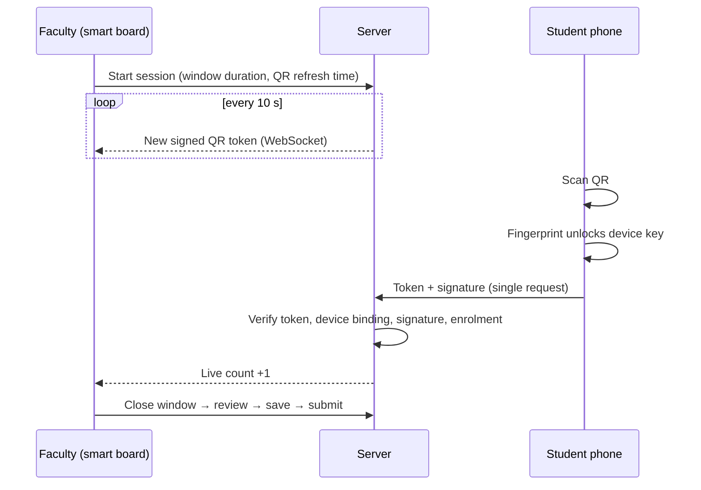

  <picture>
    <source media="(prefers-color-scheme: dark)" srcset="docs/assets/logo-dark.svg">
    
  </picture>

  <em>"Present, Sir." — Every Indian classroom, every morning. We're just making sure it's actually true.</em>

  
  
  
  

---

## The problem

Proxy attendance is the oldest trick in college. A friend says "present, sir" on your behalf, or a photo of the QR gets shared in the class group. Most attendance tools just digitise the roll call — so the cheating moves to a new medium.

PresentSir treats attendance as a **security problem first**, and a reporting problem second. The scan must come from your registered phone, unlocked by your fingerprint, within the last few seconds, inside that lecture. Anything that still looks suspicious gets flagged for faculty review — with reasons, never as an automatic penalty.

Built in 24 hours, so scope is deliberately tight: get the attendance path right, then build analytics on top of data we can actually trust.

---

## How a scan works

One request after the scan. Nothing is prefetched. The entire flow fits comfortably inside the QR refresh window.

---

## Architecture

flowchart LR
    A[Android app] -->|REST :8000| API[API]
    W[Web / smart board] -->|REST :8000| API
    W -->|WebSocket :8008| RT[Realtime]
    API --> PG[(PostgreSQL)]
    API --> R[(Redis)]
    RT --> R
    RT --> PG

Two small Python processes, one database, one Redis instance. The realtime service only pushes QR tokens and live counts. All decisions live in the API.

---

## What we chose not to build

A lot of the design is in the things we said no to.

| Decision | Reason |
|---|---|
| **No fingerprint storage** | Android never exposes them to apps, and we wouldn't want them anyway. The server holds a public key; the private key lives in secure hardware and signs only after a fingerprint match. |
| **No GPS geofencing** | Indoor GPS drifts by tens of metres, and mock-location apps are trivial. It would block honest students without stopping determined ones. |
| **No client-side integrity checks** | The client can lie. We verify a signature on the server instead. |
| **No ML for flags** | Every flag is a plain rule with a reason a teacher can read and overrule. We also track dismissal rates to measure our own false-alarm rate. |
| **No face unlock** | Adds latency. The QR window is ten seconds. |

---

## What it proves — and what it doesn't

**Proves:** a student's registered phone, unlocked by a fingerprint enrolled on that phone, scanned the current QR.

**Doesn't prove:** that the fingerprint belongs to the student. Registration is supervised at the start of semester, and the key is invalidated when a new fingerprint is added — which narrows the gap without closing it. A friend relaying a live QR is caught only by soft signals (timing, repeated pairs, headcount mismatch) that go to a faculty review queue.

We'd rather say that plainly than pretend otherwise.

---

## Feature overview

| Area | What's included |
|---|---|
| **Attendance** | Rotating signed QR · one user per device · biometric-signed scan · two-step save and submit · manual marking with required reason |
| **Integrity** | Append-only audit log · proxy-risk flags with plain-language reasons · faculty review queue · student disputes |
| **Students** | Subject-wise attendance · trends · "you need N more lectures to reach the threshold" |
| **Faculty** | Live board with counter · roster review · shortage list · early-warning list · CSV export |
| **Admin** | Supervised device registration · phone-change approvals · attendance threshold config · institution-level analytics |

---

## Repository layout

presentsir/
├── backend/    FastAPI — REST API (:8000) and realtime service (:8008)
├── web/        React — faculty board, admin panel, student read-only view
├── app/        React Native — Android student app
└── docs/       BACKEND_SPEC.md, FRONTEND_SPEC.md, assets/
---

## Running locally

**Prerequisites:** Python 3.11, Node.js, Docker, Android Studio, and a **real Android device** with USB debugging enabled. Emulators cannot produce a hardware-backed biometric key.

# 1. Start backing services
docker compose up -d

# 2. API
cd backend
cp .env.example .env
pip install -r requirements.txt
alembic upgrade head
python scripts/seed.py          # loads realistic demo data
uvicorn app.main:app --port 8000

# 3. Realtime service (separate terminal)
uvicorn app.realtime:app --port 8008

# 4. Web
cd web && npm install && npm run dev    # → http://localhost:5173

# 5. Android app
cd app && npm install
adb reverse tcp:8000 tcp:8000
adb reverse tcp:8008 tcp:8008
adb reverse tcp:8081 tcp:8081
npx react-native run-android

> These commands describe the setup we are building toward. Treat them as a target, not a verified runbook, until all folders exist.

**Service ports at a glance**

| Service | Port |
|---|---|
| API | 8000 |
| Realtime (WebSocket) | 8008 |
| PostgreSQL | 5432 |
| Redis | 6379 |
| Web dev server | 5173 |
| Metro bundler | 8081 |

API docs are available at `http://localhost:8000/docs` in development.

---

## Documentation

| Doc | Contents |
|---|---|
| [`docs/BACKEND_SPEC.md`](docs/BACKEND_SPEC.md) | Data model, QR and signing protocol, endpoints, risk rules, security checklist |
| [`docs/FRONTEND_SPEC.md`](docs/FRONTEND_SPEC.md) | Design language, screens, screen-to-endpoint mapping |

---

## Build progress

- [ ] Spike — fingerprint-signed scan verified by the server on a real device
- [ ] Supervised registration, one user per device
- [ ] Smart board — rotating QR, live counter
- [ ] Close → review → save → submit, audit log
- [ ] Student and faculty analytics
- [ ] Proxy flags and early-warning queue
- [ ] Admin panel
- [ ] Demo rehearsed, backup recording made

---

## Team

| Name | Focus |
|---|---|
| _name_ | Backend |
| _name_ | Android app |
| _name_ | Web |
| _name_ | Data and analytics |

---

## A note on tooling

We use AI coding assistants, under written rules (see the top of `docs/BACKEND_SPEC.md`), with human review on anything touching auth, crypto, or attendance writes. The product itself uses no AI in its decisions — attendance changes only when a person changes it.

---

## License
